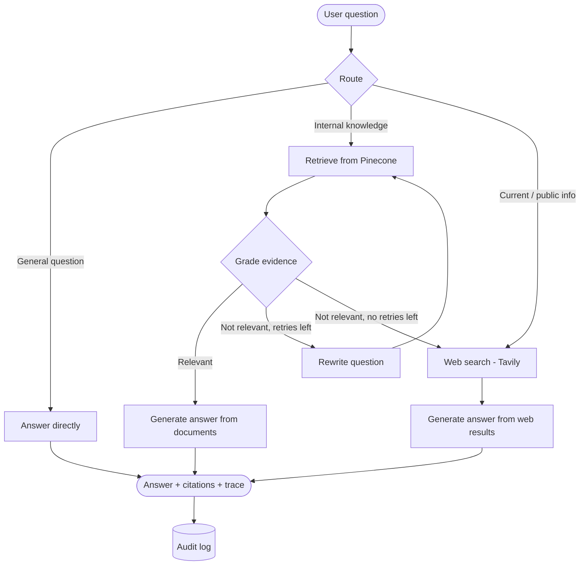
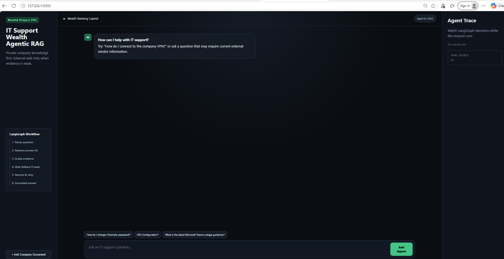
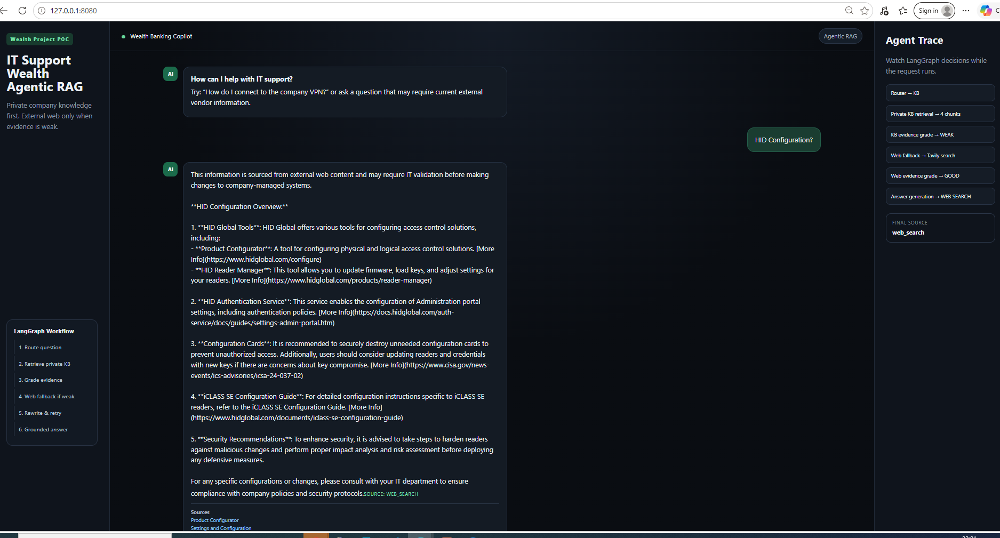
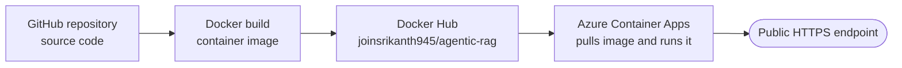
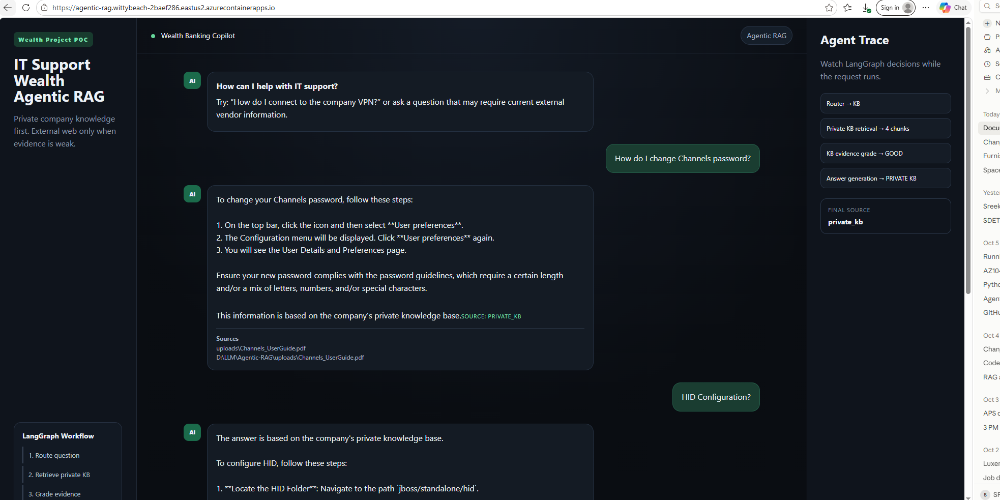

# Agentic RAG Assistant for Wealth Banking Support

An agentic Retrieval-Augmented Generation (RAG) assistant that answers staff questions about wealth banking platforms and authentication setup, using the organization's own documents first and the public web only when the documents fall short.

Built with **LangGraph, FastAPI, OpenAI, Pinecone and Tavily**, with a web interface for chatting, uploading documents and inspecting how the agent reached each answer.

---

## The problem

Teams supporting a wealth banking platform rely on long vendor guides and configuration documents: channel user guides, front office manuals, authentication setup instructions. Finding the right answer is slow:

- The guides run to hundreds of pages, and keyword search returns too many hits.
- A general-purpose chatbot doesn't know the internal documents and may invent answers.
- Some questions need current public information that the documents don't contain.

## The solution

The assistant reads the organization's documents, finds the passages relevant to a question, **checks whether they actually answer it**, and only then responds, citing its sources. When the documents aren't enough, it rewrites the question and retries, and falls back to a web search, labeling web sources separately from internal ones.

Example questions:

- *How do I configure HID authentication for a new user?*
- *What can a relationship manager do in the Front Office module?*
- *Which customer channels are supported, and how are they set up?*

---

## Knowledge base

| Document | Format | Covers |
|---|---|---|
| Channels User Guide | PDF | The wealth banking platform's customer channels and their use |
| Front Office User Guide | PDF | Front office functions for advisors and relationship managers |
| Setup Configuration HID | Word (.docx) | Setting up and configuring HID authentication |
| Company IT Handbook | Markdown | Sample internal IT policies (included demo data) |
| Service Desk Runbook | Markdown | Sample service desk procedures (included demo data) |

> **The banking and HID documents are not included in this repository**, as they are third-party material. Add your own documents through the interface (see [Adding documents](#adding-documents)).

---

## How the agent works

Unlike a basic RAG pipeline, which always retrieves once and answers, this agent decides **how** to answer each question and **checks its own evidence** before responding. The workflow is a LangGraph state graph:



### Phases

| # | Phase | What happens |
|---|---|---|
| 1 | **Route** | An LLM classifies the question and picks a path: answer directly, search the internal documents, or go to the web. |
| 2 | **Retrieve** | The question is embedded and the closest document chunks are fetched from Pinecone. |
| 3 | **Grade** | An LLM judges whether the retrieved chunks actually answer the question, so the agent doesn't answer from irrelevant text. |
| 4 | **Rewrite & retry** | If the evidence is weak, the question is reworded (for example, using the documents' terminology) and retrieval runs again, up to a set limit. |
| 5 | **Web search** | If the documents still don't help, or the question needs current public information, Tavily searches the web. |
| 6 | **Generate** | The answer is written strictly from the chosen evidence. Document answers are restricted to the knowledge base; web answers state that internal documents were insufficient. |
| 7 | **Cite & audit** | Sources are returned as citations, labeled *private KB* or *web*. The question, path taken and sources are logged for auditing. |

### The three answer paths

- **Direct:** general questions that need no lookup are answered by the LLM without retrieval, which saves time and cost.
- **Private knowledge base:** the main path. Answers come only from your documents, with the source file cited.
- **Web:** the fallback for questions the documents can't answer, with web pages cited by URL.

The interface shows the **trace** for each answer, so you can see which path the agent took and why.

---

## Ingestion pipeline

Documents go through the same steps whether they come from the sample folder or the upload form:

1. **Load:** text is extracted from PDF, Word (.docx), text and Markdown files.
2. **Chunk:** the text is split into small, overlapping passages, so retrieval can return the exact section that answers a question.
3. **Embed:** each chunk is converted to a vector with OpenAI's `text-embedding-3-small`.
4. **Store:** vectors are saved in Pinecone, in the `company-it-kb` namespace of the `fde-it-support-rag` index.

Scanned PDFs (images of pages, with no selectable text) are not supported.

---

## Tech stack

| Layer | Technology |
|---|---|
| Agent workflow | LangGraph, LangChain |
| LLM | OpenAI `gpt-4o-mini` |
| Embeddings | OpenAI `text-embedding-3-small` |
| Vector store | Pinecone |
| Web search | Tavily |
| Backend API | FastAPI, Uvicorn |
| Frontend | HTML (Jinja2 templates), CSS, JavaScript |
| Audit log | SQLite |
| Deployment | Docker |

---

## Project structure

```
Agentic-RAG/
├── app/
│   ├── api/routes.py          # API endpoints: chat, upload, health, audit
│   ├── core/config.py         # Settings loaded from .env
│   ├── core/logging.py        # Logging setup
│   ├── rag/state.py           # Shared state passed between agent steps
│   ├── rag/workflow.py        # LangGraph workflow: route, retrieve, grade, rewrite, search, generate
│   ├── rag/vectorstore.py     # Embeddings, Pinecone connection, retriever
│   ├── services/ingestion.py  # Document loading and chunking
│   ├── services/audit.py      # Audit logging
│   └── main.py                # FastAPI app, templates and static files
├── data/sample_kb/            # Sample documents loaded by ingest_sample_kb.py
├── templates/index.html       # Web interface
├── static/                    # CSS and JavaScript for the interface
├── ingest_sample_kb.py        # Loads the sample documents into Pinecone
├── run.py                     # Starts the server
├── Dockerfile
├── requirements.txt
└── .env.example               # Settings template
```

---

## Getting started

### Prerequisites

- Python 3.11
- API keys for [OpenAI](https://platform.openai.com/), [Pinecone](https://www.pinecone.io/) and [Tavily](https://tavily.com/)

### 1. Set up the environment

```powershell
git clone https://github.com/YOUR-USERNAME/YOUR-REPO.git
cd YOUR-REPO
python -m venv .venv
.\.venv\Scripts\Activate.ps1        # macOS/Linux: source .venv/bin/activate
pip install -r requirements.txt
```

### 2. Configure

Copy the template and fill in your keys:

```powershell
Copy-Item .env.example .env         # macOS/Linux: cp .env.example .env
```

| Setting | Required | Description |
|---|---|---|
| `OPENAI_API_KEY` | Yes | Used for the LLM and embeddings |
| `PINECONE_API_KEY` | Yes | Vector store |
| `TAVILY_API_KEY` | Yes | Web search fallback |
| `ADMIN_API_KEY` | Recommended | Password for uploading documents (default: `change-me`) |
| `APP_NAME` | No | Name shown in the interface |

Other defaults (index name, namespace, models) are in `app/core/config.py` and can be overridden in `.env`.

### 3. Load the sample documents

```powershell
python ingest_sample_kb.py
```

### 4. Run

```powershell
python run.py
```

Open **http://127.0.0.1:8080**. The interactive API documentation is at **http://127.0.0.1:8080/docs**.

### Docker

```powershell
docker build -t agentic-rag .
docker run -p 8080:8080 --env-file .env agentic-rag
```

---

## Adding documents

1. Open the app and go to **Add Company Document**.
2. Choose a PDF, Word (.docx), text or Markdown file.
3. Enter the admin key and click **Index Document**.

The file is chunked, embedded and stored in Pinecone immediately, and is available for questions straight away. Older `.doc` files must be saved as `.docx` first.

---

## Roadmap

- **Incremental ingestion:** process only new or changed files, with fixed chunk IDs to prevent duplicates.
- **Document sources:** sync from Google Drive, Shared Drives or network folders.
- **Evaluation:** measure answer accuracy and retrieval quality on a fixed set of test questions.
- **Access control:** restrict documents by team or role.

---

## License

See [LICENSE](LICENSE).






---

## Deployment

The app runs on **Azure Container Apps**, using a Docker image published to **Docker Hub**.

**Live demo:** https://agentic-rag.wittybeach-2baef286.eastus2.azurecontainerapps.io



### How it is set up

| Component | Choice | Why |
|---|---|---|
| Source control | GitHub | Version history and public code |
| Packaging | Docker (`python:3.11-slim` base) | Same environment locally and in the cloud |
| Image registry | Docker Hub (public) | Free hosting for the image |
| Hosting | Azure Container Apps (Consumption plan) | Serverless containers, HTTPS included |
| Scaling | 0 to 1 replicas | Scales to zero when idle, so it stays within the free monthly allowance |
| Resources | 0.5 vCPU, 1 GiB memory | Enough for LangGraph and document processing |
| Configuration | Container App secrets | API keys are kept out of the image and the repository |

### Deployment steps

1. **Build the image** from the project folder:
```bash
   docker build -t agentic-rag .
```
2. **Push it to Docker Hub:**
```bash
   docker tag agentic-rag joinsrikanth945/agentic-rag:v1
   docker push joinsrikanth945/agentic-rag:v1
```
3. **Create the Azure environment:**
```bash
   az group create --name agentic-rag-rg --location eastus2
   az containerapp env create --name agentic-rag-env --resource-group agentic-rag-rg \
     --location eastus2 --logs-destination none
```
4. **Deploy the container app**, with API keys passed as secrets:
```bash
   az containerapp create --name agentic-rag --resource-group agentic-rag-rg \
     --environment agentic-rag-env \
     --image docker.io/joinsrikanth945/agentic-rag:v1 \
     --target-port 8080 --ingress external \
     --cpu 0.5 --memory 1.0Gi --min-replicas 0 --max-replicas 1 \
     --secrets openai-key=<key> pinecone-key=<key> tavily-key=<key> admin-key=<password> \
     --env-vars OPENAI_API_KEY=secretref:openai-key PINECONE_API_KEY=secretref:pinecone-key \
                TAVILY_API_KEY=secretref:tavily-key ADMIN_API_KEY=secretref:admin-key
```

### Releasing a new version

```bash
docker build -t agentic-rag .
docker tag agentic-rag joinsrikanth945/agentic-rag:v2
docker push joinsrikanth945/agentic-rag:v2
az containerapp update --name agentic-rag --resource-group agentic-rag-rg \
  --image docker.io/joinsrikanth945/agentic-rag:v2
```

Each release uses a new image tag, so Azure keeps a revision history and older versions can be restored.

### Notes

- **Cold starts:** after a period without traffic, the app scales to zero, so the first request takes a few seconds while it starts.
- **Storage:** indexed documents live in Pinecone and persist across restarts. Files saved inside the container and the audit log are temporary on this setup.
- **Cost control:** the OpenAI account has a monthly spending limit, and the Azure subscription has a

Deployed in Azure as a Container App

